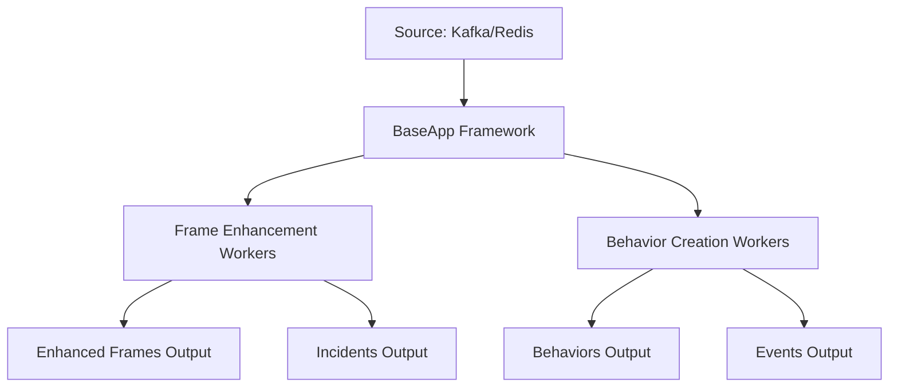

# Building an MDX Analytics App (Warehouse2D example)

> Part of behavior-analytics docs. See `../README.md` for the project overview. For the Cursor case study, see `readmes/cursor-dev-example-walkthrough.md`.

This guide walks you through creating an analytics application using the MDX `behavior-analytics` library. We'll use the `Analytics2DApp` at `apps/analytics/main_analytics_2d_app.py` as our reference implementation to demonstrate how to build a robust analytics app that processes video frames and generates behaviors and events. Most apps load configuration from JSON via `AppConfig` (see `configs/` examples and defaults in `config.py`).

## Table of Contents

1. [Overview](#overview)
2. [Application Architecture](#application-architecture)
3. [Step-by-Step Implementation](#step-by-step-implementation)
4. [Configuration](#configuration)
5. [Running the Application](#running-the-application)
6. [Advanced Features](#advanced-features)

## Overview

An MDX analytics app processes incoming video frames from sources like Kafka, transforms them into meaningful data structures, tracks object behaviors over time, and generates events when objects interact with defined regions of interest (ROIs) and tripwires.

Key capabilities:
- Frame enhancement and transformation
- Object behavior tracking with state management
- Event generation (ROI and tripwire events)
- Scalable worker-based architecture with multi-processing

## Application Architecture

The `Analytics2DApp` extends `mdx.analytics.core.app.app_base.BaseApp` and implements a multi-processor architecture with separate workers for different processing tasks:



## Step-by-Step Implementation

### Step 1: Import Required Modules

Start by importing all necessary modules and setting up logging:

```python
import logging

from mdx.analytics.core.app.app_base import BaseApp
from mdx.analytics.core.schema.config import AppConfig
from mdx.analytics.core.schema.proto import schema_pb2 as nvSchema
from mdx.analytics.core.stream.state.behavior.state_management_e import StateMgmtEWithTripwire
from mdx.analytics.core.stream.state.frame.frame_state_management import FrameStateMgmt
from mdx.analytics.core.transform.event.roi_event import ROIEvent
from mdx.analytics.core.transform.event.tripwire_event import TripwireEvent
from mdx.analytics.core.utils.schema_util import messages_to_map, nv_frame_to_messages, group_frames_by_sensor_id
from mdx.analytics.core.utils.processing_stats import BatchStats

logger = logging.getLogger(__name__)
```

**Module Breakdown:**
- `BaseApp`: The core application class that provides infrastructure for source/sink management
- `AppConfig`: Configuration management for application settings
- `schema_pb2`: Protocol buffer definitions for frame and message structures
- `StateMgmtEWithTripwire`: Enhanced state management that tracks objects and detects tripwire interactions
- `ROIEvent` and `TripwireEvent`: Event generators for spatial analytics
- `schema_util`: Utilities for converting between different data formats
- `BatchStats`: Performance tracking for processing batches

### Step 2: Define the Application Class

Create your main application class by extending `BaseApp`:

```python
class Analytics2DApp(BaseApp):

    def __init__(self, config: AppConfig, calibration_path: str | None) -> None:
        super().__init__(config, calibration_path)
        
        # Initialize state management with tripwire support
        self.state_mgmt = StateMgmtEWithTripwire(self.config, self.calibration)
        self.frame_state_mgmt = FrameStateMgmt(self.config)
        
        # Initialize event processors
        self.roi_event = ROIEvent(self.config, self.calibration)
        self.tripwire_event = TripwireEvent(self.config, self.calibration)

        # Register processing handlers with worker counts
        self.register_processor(
            self.read_raw, 
            self.create_behaviors, 
            int(self.config.get_app_config("numWorkersForBehaviorCreation"))
        )
        self.register_processor(
            self.read_raw, 
            self.enhance_frames, 
            int(self.config.get_app_config("numWorkersForFrameEnhancement"))
        )
```

**Key Components:**
- **State Management**: `StateMgmtEWithTripwire` tracks object positions over time and detects when objects cross tripwires
- **Event Processors**: Handle ROI entry/exit and tripwire crossing events
- **Worker Registration**: Uses `register_processor()` to set up parallel processing pipelines

### Step 3: Implement Frame Enhancement Handler

The frame enhancement handler transforms raw frames using calibration data and updates frame-level stats (FOV/ROI metrics) before generating incidents. Filtering to calibrated sensors is recommended but optional:

```python
def enhance_frames(self, frames: list[nvSchema.Frame], stats: BatchStats) -> None:
    # Filter to calibrated sensors and enhance
    frames = self.calibration.filter_frames_by_sensor_id(frames)
    enhanced_frames = [self.calibration.transform_frame(frame) for frame in frames]
    self.write_frames(enhanced_frames)

    # Update frame-level incidents and write them out
    frames_map = group_frames_by_sensor_id(enhanced_frames)
    for sensor_id, sensor_frames in frames_map.items():
        self.frame_state_mgmt.update_frames(sensor_id, sensor_frames)
        incidents = self.frame_state_mgmt.get_incidents(sensor_id)
        logger.info("Batch %s - Created %d incident(s) for sensor %s", stats.batch_id, len(incidents), sensor_id)
        self.write_incidents(incidents)
```

**Process Flow:**
1. Filter to calibrated sensors
2. Calibration transform
3. Write enhanced frames
4. Update frame-state incidents and write incidents

### Step 4: Implement Behavior Creation Handler

The behavior creation handler is the core analytics processor:

```python
def create_behaviors(self, frames: list[nvSchema.Frame], stats: BatchStats) -> None:
    """
    Process frames to create object behaviors and generate events.
    
    Args:
        frames: List of input frames to process
        stats: Performance tracking object
    """
    # (Optional) Filter to calibrated sensors
    frames = self.calibration.filter_frames_by_sensor_id(frames)

    # Convert frames to messages (one per detected object)
    batch_messages = [
        msg
        for frame in frames
        for msg in nv_frame_to_messages(frame, object_filter=self.config.state_mgmt_filter)
    ]

    if not batch_messages:
        logger.debug("Batch %s - No messages to process in batch.", stats.batch_id)
        return

    logger.info("Batch %s - Transformed %d frame(s) to %d message(s)", stats.batch_id, len(frames), len(batch_messages))

    # Apply calibration to messages and group by sensor
    updated_messages = [self.calibration.transform(msg) for msg in batch_messages]
    updated_messages_map = messages_to_map(updated_messages)

    behaviors: list[nvSchema.Behavior] = []
    events: list[nvSchema.Event] = []

    for sensor_id, msgs in updated_messages_map.items():
        behavior, trip = self.state_mgmt.update_behavior(message_key=sensor_id, messages=msgs)
        if behavior:
            behaviors.append(behavior)
        if trip:
            events.extend(self.tripwire_event.get_events(trip))
            events.extend(self.roi_event.get_events(trip))

    logger.info("Batch %s - Created %d behavior(s)", stats.batch_id, len(behaviors))
    logger.info("Batch %s - Created %d event(s)", stats.batch_id, len(events))

    self.write_behaviors(behaviors)
    self.write_events(events)
```

**Process Flow:**
1. (Optional) Filter to calibrated sensors
2. Frame→message conversion
3. Calibration on messages
4. Group messages by sensor
5. State management + event generation
6. Write behaviors/events (with optional logging)

### Step 5: Add Application Entry Point

Create the main entry point for command-line execution:

```python
if __name__ == '__main__':
    from mdx.analytics.core.app.app_runner import run
    
    run(Analytics2DApp)
```

The `run()` function handles:
- Command-line argument parsing
- Configuration file loading
- Application lifecycle management
- Error handling and logging setup

## Configuration

- Create a JSON configuration file (e.g., `configs/warehouse_2d_config.json`).

- Have a calibration file defining coordinate transforms and spatial elements (e.g., `configs/calibration_cafeteria_2d.json`).


## Running the Application

### Command Line Arguments

The `mdx.analytics.core.app.app_runner.run()` function supports these arguments:

- `--config`: Path to the application configuration JSON file
- `--calibration`: Path to the calibration configuration JSON file

### Run from the command line

```bash
python apps/analytics/main_analytics_2d_app.py \
    --config configs/warehouse_2d_config.json \
    --calibration configs/calibration_cafeteria_2d.json
```


## Advanced Features

### Multiple Processing Pipelines

The `register_processor()` method allows you to create multiple parallel processing pipelines, each with its own worker pool:

```python
def __init__(self, config: AppConfig, calibration_path: str) -> None:
    super().__init__(config, calibration_path)
    
    # Register multiple processors with different worker counts
    self.register_processor(self.read_raw, self.fast_processor, 4)
    self.register_processor(self.read_raw, self.detailed_processor, 2)
    self.register_processor(self.read_behaviors, self.behavior_analyzer, 1)
```

### Performance Monitoring

The scheduler logs per-batch stats at INFO by default (batch size fetched, processing speed for the batch, and running average msgs/sec). `BatchStats` arrives with the batch size already set (num_msgs). If you want additional/custom details, you can log from your processor:

```python
def my_processor(self, frames: list[nvSchema.Frame], stats: BatchStats) -> None:
    # Process frames...
    logger.info(
        "Worker %s batch %s: size=%d rate=%.2f msg/sec",
        stats.worker_id,
        stats.batch_id,
        stats.num_msgs,
        stats.msgs_per_sec,
    )
```

### Error Handling and Resilience (optional)

Uncaught exceptions in a processor bubble up and will shut down the app. If you prefer to skip bad batches and keep running, wrap your processor logic and log the error:

```python
def create_behaviors(self, frames: list[nvSchema.Frame], stats: BatchStats) -> None:
    try:
        # Main processing logic...
        ...
    except Exception as exc:
        logger.error("Error processing batch %s: %s", stats.batch_id, exc)
        stats.update(0)  # still advance stats so the worker loop continues
        return
```
