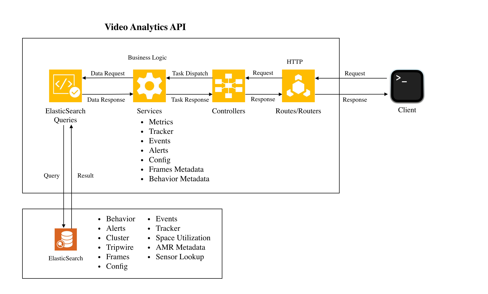

# VSS Video Analytics APIs

This module contains a sample app which exposes REST-APIs for VSS Video Analytics applications.

## Introduction



The sample app was built using Node.js and Express, exposing various REST-API endpoints.

### Available Endpoints

The API provides endpoints for the following functionalities:

- **Metrics** - Computation of key performance indicators
- **Tracker** - Tracker-related data retrieval
- **Frames** - Frame metadata
- **Behavior** - Behavior metadata
- **Clustering** - Clustering results
- **Events** - Event data
- **Sensor** - Sensor-related operations
- **Config** - Configuration management
- **Alerts** - Alert notifications
- **Incidents** - Incident tracking

All API results are retrieved from Elasticsearch. The data is pushed to the database once the `vss-behavior-analytics` module has processed the raw data.

### OpenAPI Specification

The OpenAPI specifications can be found in the [specification](./src/app/specification/openapi.json).

## Getting Started

### Dependencies

1. [Node.js](https://nodejs.org/en/ "Nodejs.org") version 22.22.3.
2. Elasticsearch version 9.3.4
3. Kafka (optional) - Required for RTLS application and notification related functionalities

### Installation

```bash
cd src/web-api-core
npm install

cd ../app
npm install --save ../web-api-core
npm install
```

### Running the Server

The video-analytics-api server can be started with default configs using the following command:

```bash
cd src/app
npm start
```

The default configs can be overridden by passing command line argument `config`. The following command can be used to start the server with user provided configs:

```bash
cd src/app
npm start -- --config /absolute/path/to/config.json
```

The server runs on port **8081** by default.

## Configuration

The default configuration can be found at [config.json](./configs/default-configs/config.json).

### Configuration Options

| Section | Option | Description |
|---------|--------|-------------|
| `server.port` | Port number | Default: 8081 |
| `server.configs` | Server settings | Post body size limit, AMR retention, simulation mode |
| `elasticsearch.node` | Elasticsearch URL | Default: http://localhost:9200 |
| `elasticsearch.indexPrefix` | Index prefix | Default: mdx- |
| `elasticsearch.retries` | Elasticsearch client max retries per request | Default: 15 |
| `kafka.brokers` | Kafka broker list | Required for notifications, RTLS |
| `kafka.retries` | KafkaJS client max retries | Default: null |

**Note**: If any change needs to be made, it is recommended to create a copy of the config file and make changes so that the default-config is preserved.

## Documentation

- [Configuration Guide](./readmes/configuration.md)
- [Docker and Deployment](./readmes/docker.md)
- [Modules Overview](./readmes/modules-overview.md)
- [Testing Guide](./readmes/testing.md)
