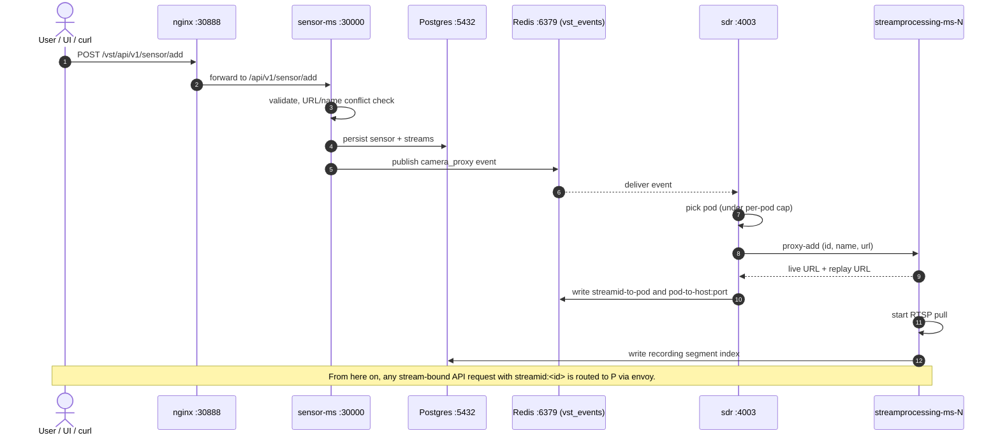
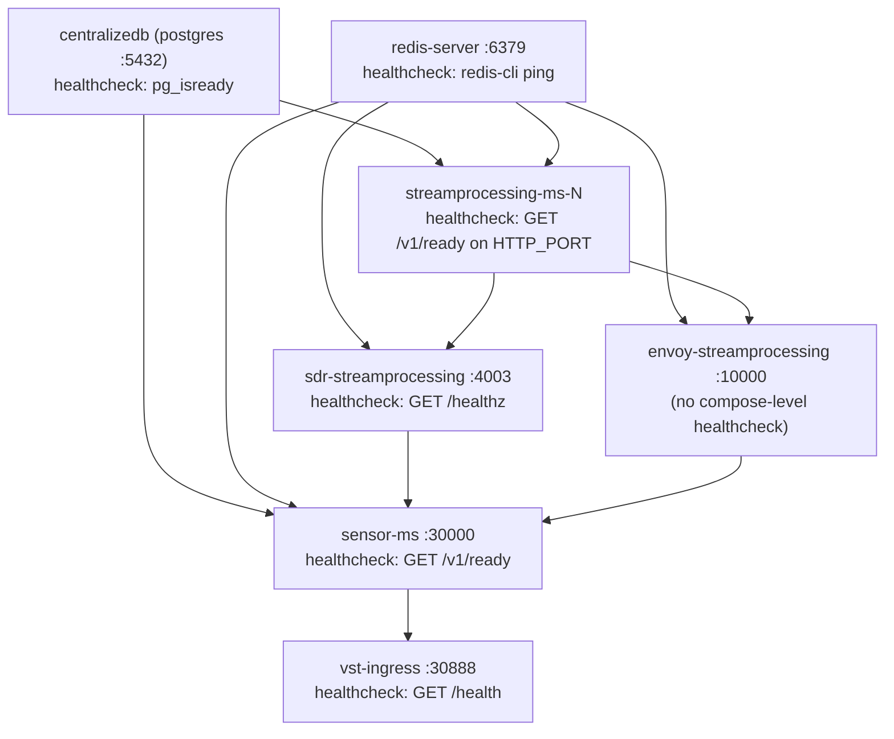
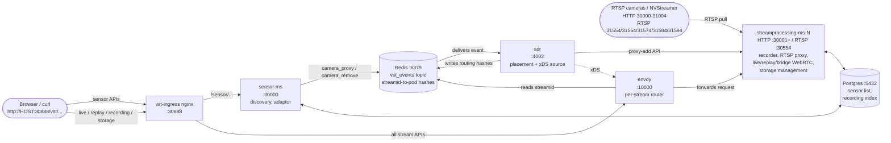

# SPDX-FileCopyrightText: Copyright (c) 2026 NVIDIA CORPORATION & AFFILIATES. All rights reserved.
# SPDX-License-Identifier: MIT
#
# Permission is hereby granted, free of charge, to any person obtaining a
# copy of this software and associated documentation files (the "Software"),
# to deal in the Software without restriction, including without limitation
# the rights to use, copy, modify, merge, publish, distribute, sublicense,
# and/or sell copies of the Software, and to permit persons to whom the
# Software is furnished to do so, subject to the following conditions:
#
# The above copyright notice and this permission notice shall be included in
# all copies or substantial portions of the Software.
#
# THE SOFTWARE IS PROVIDED "AS IS", WITHOUT WARRANTY OF ANY KIND, EXPRESS OR
# IMPLIED, INCLUDING BUT NOT LIMITED TO THE WARRANTIES OF MERCHANTABILITY,
# FITNESS FOR A PARTICULAR PURPOSE AND NONINFRINGEMENT. IN NO EVENT SHALL
# THE AUTHORS OR COPYRIGHT HOLDERS BE LIABLE FOR ANY CLAIM, DAMAGES OR OTHER
# LIABILITY, WHETHER IN AN ACTION OF CONTRACT, TORT OR OTHERWISE, ARISING
# FROM, OUT OF OR IN CONNECTION WITH THE SOFTWARE OR THE USE OR OTHER
# DEALINGS IN THE SOFTWARE.

# VIOS Architecture — Stream-Processor + Sensor Deployment

This skill explains the **stream-processor microservice (MS) + sensor-MS** deployment of VIOS. It is the reference model used by the one-click deploy, the default in `vios-deployment`, and the topology BDD/sanity tests run against. Use it to build a mental model of what runs where, how requests are routed, and how state flows between services. It deliberately stays at the deployment / container / protocol level — for source-level details, grep the codebase.

---

## 1. Containers in the stack

| Container | Listens (host net) | Role |
|---|---|---|
| `vst-ingress` (nginx) | `30888` | Reverse proxy. Serves the React UI under `/vst/`, splits backend traffic between sensor-MS (`30000`) and the stream-processor data plane through Envoy (`10000`). |
| `sensor-ms` | `30000` (HTTP), `8080` (Prom) | Control plane. Owns sensor discovery, sensor add/delete, adaptor loading (`vst_rtsp` / `onvif` / `milestone_onvif`), stream monitoring, and the centralized DB. No recording, no RTSP server, no storage. |
| `streamprocessing-ms-N` | `30001` (HTTP, pod 1), `30554` (RTSP, pod 1), `8087` (Prom) | Data plane. One pod = one shard of streams. Owns recording, RTSP proxy server, live/replay WebRTC, clip generation, storage management, image capture. |
| `envoy-streamprocessing` | `10000` | Header-based router that fans `streamid`-keyed requests out to the right `streamprocessing-ms-N` pod. xDS pulls config from SDR. |
| `sdr-streamprocessing` | `4003` | Workload Distribution Manager. Watches Redis for sensor add/remove events, decides which pod owns a stream, attaches it to that pod, and writes the streamid→pod mapping to Redis for Envoy to read. |
| `centralizedb` (postgres) | `5432` | Shared metadata DB. Sensor list, recording manifests, configs. Both sensor-MS and every stream-processor pod open connections. |
| `redis-server` | `6379` | Message bus + routing table. SDR consumes the `vst_events` topic here; Envoy reads the streamid→pod hash here on every request. |
| `nvstreamer` | `31000–31004` (HTTP, one per instance), `31554`, `31564`, `31574`, `31584`, `31594` (RTSP, spaced by 10) | **Separately deployed** loopback RTSP source farm for testing / video-file-driven sensors. VIOS treats nvstreamer endpoints as a regular RTSP camera fleet. |
| `prometheus` / `grafana` | `9090` / `3000` | Optional, gated by `--profile monitoring`. |
| `minio` | `9000` / `9001` | Optional object storage, gated by `--profile minio`. |

Pod 2 (`streamprocessing-ms-2`) is shipped commented-out — bring it up by uncommenting the matching blocks in the compose / Envoy / SDR-cluster configs (each marked `# [Pod 2 disabled]`).

Everything uses `network_mode: host` — there is no docker bridge between these containers; all addressing is `127.0.0.1:<port>` or `$HOST_IP:<port>`.

---

## 2. Request routing: ingress → Envoy → pod

Nginx routes incoming `/vst/...` traffic:

| URL prefix | Upstream | Notes |
|---|---|---|
| `/vst/` static (incl. `assets/`, `favicon/`) | served from inside `vst-ingress` | React SPA |
| `/vst/api/v1/sensor/...` | `127.0.0.1:30000` (sensor-MS) | sensor CRUD, discovery, status |
| `/vst/api/v1/replay/stream/{id}/picture` | `127.0.0.1:10000` (Envoy) | historical snapshot — explicitly cacheable |
| `/vst/api/v1/...` (catch-all) | `127.0.0.1:10000` (Envoy) | recording, livestream, replay, storage, clip download, WebRTC signalling, WebSocket. Request and response buffering are disabled so bodies stream. |
| `/vst/storage/` | `127.0.0.1:10000` (Envoy) | direct file-serve path used for download by filename |

The MMS variant (`NGINX_MODE=mms`) is the same shape, except timeline queries (`/vst/api/v1/record/.../timelines`, `/vst/api/v1/storage/.../timelines`) are rewritten to `/api/v1/sensor/.../timelines` and forwarded to sensor-MS instead of the stream-processor.

Envoy listens on `10000` and runs a small request filter on every call:

1. Read the `streamid` header — for a WebSocket upgrade, fall back to a `?streamId=` query parameter.
2. Look up the streamid in a Redis hash to find which pod owns the stream.
3. Look up the pod name in a second Redis hash to find the host endpoint.
4. Rewrite the upstream cluster so xDS routes the request to that pod.
5. If there is no `streamid`, fall through to a static round-robin cluster covering all pods, with outlier detection and circuit breakers.

**Key invariant:** any stream-bound API (`/api/v1/live/...`, `/api/v1/replay/...`, `/api/v1/recording/...`, etc.) must carry `streamid: <uuid>`. Without it, the request lands on whichever pod the round-robin picks, which may not own the stream.

---

## 3. SDR (Workload Distribution Manager) — the orchestrator

SDR is the brain. It does **not** terminate any media — it only decides which pod handles which sensor and programs Envoy.

Per pod stream cap is set by `WDM_WL_THRESHOLD` (default `100`, also surfaced as `MAX_STREAMS_PER_POD` in compose). Initial state comes from Redis event replay, not from a REST poll of sensor-MS.

Flow:

1. Sensor-MS publishes events on Redis under the `vst_events` topic, using the action names `camera_proxy` (add / attach) and `camera_remove` (detach).
2. SDR consumes the event and extracts the stream identifier.
3. SDR picks a pod under the per-pod stream cap. Pod identity comes from its cluster-config JSON plus its container→port map.
4. SDR POSTs the proxy-add API on the chosen pod with `{id, name, url}`. The pod registers the stream in its RTSP proxy server, starts the recorder, and returns a proxy live URL plus a replay URL.
5. SDR writes two Redis hashes that Envoy reads: streamid→pod-name, and pod-name→host:port. From this point on, any future API call carrying the streamid will be routed to the correct pod.
6. On `camera_remove`, SDR calls the proxy-delete API on the owning pod and clears both Redis entries.

SDR also exposes `/healthz` on its own port and acts as the xDS source for Envoy (cluster + route discovery over REST).

---

## 4. Sensor lifecycle — RTSP add flow



Reading the diagram:

1. **UI / curl** sends `POST /vst/api/v1/sensor/add` (or `/sensor/discovery/...` for ONVIF). nginx forwards to sensor-MS.
2. Sensor-MS validates the body, runs URL-then-name conflict checks, and persists the sensor + its streams to Postgres.
3. **Sensor-MS publishes `camera_proxy` to Redis.** Because sensor-MS runs with `NEED_RTSPSERVER=false` in this topology, it does not call the RTSP proxy directly. It hands the event off through its notification interface (which routes to Redis when `use_message_broker == "redis"`). The active adaptor (`VST_ADAPTOR`: `vst_rtsp`, `onvif`, `milestone_onvif`) is what produced the sensor row; for discovery cycles, adaptor-driven add/remove deltas are turned into the same `camera_proxy` / `camera_remove` events.
4. **SDR** consumes the event, picks a pod under its per-pod cap, and POSTs the proxy-add API on that pod with `{id, name, url}`. The pod registers the proxy and returns the live URL (typically `rtsp://<host>:30554/...`) and a replay URL.
5. SDR writes the streamid→pod and pod→host bindings into Redis so Envoy can route subsequent requests for this streamid.
6. The pod pulls the source via its embedded RTSP client, writes recording segments to `${VST_VIDEO_STORAGE_PATH}`, and indexes them in Postgres.
7. UI queries `GET /vst/api/v1/sensor/list` (sensor-MS) for the catalog and routes any live/replay/recording API for that sensor through Envoy with `streamid: <sensorId>`.

Sensor scan (UI "Scan Sensors") triggers a discovery cycle on the adaptor — the cached list is diffed against the fresh probe, and the deltas re-drive the same event → Redis → SDR → pod path.

---

## 5. RTSP workflow (live and proxy)

Two distinct RTSP paths inside the stack.

**Inbound — from the camera / NVStreamer to the pod:**

- The pod's embedded RTSP client pulls the source.
- Frames are hardware-decoded on NVDec when present, decoders are shared across consumers, and the same buffer chain feeds both recording and live WebRTC.

**Outbound — from the pod to external RTSP clients:**

- Each pod runs an embedded RTSP proxy server, by default on `30554` (pod 2 would use `30564`).
- After SDR attaches a stream, the proxy exposes a session URL of the form `rtsp://<host>:30554/live/<streamId>` for live and a corresponding `/vod/<streamId>` URL for replay.
- Useful for external consumers (analytics, NVR, ffprobe) that prefer RTSP over WebRTC.

---

## 6. File upload (sensor type "file")

Two ingest patterns:

**a) NVStreamer-backed file sensor (primary).** The user uploads MP4 files to an NVStreamer instance (UI on ports `31000`–`31004`). NVStreamer loops the file as an RTSP source. The VIOS config lists each NVStreamer endpoint as a stream pool, and "Scan Sensors" in the VIOS UI pulls the catalog from each NVStreamer. From here on the file is just another RTSP camera (see §5).

**b) Direct storage upload.** Files can also be uploaded straight to the storage service for catalog / replay:

- `POST /vst/api/v1/storage/file` (multipart with the media file plus a metadata JSON; sensor ID and timestamp are required, stream name / event info / tag / checksum optional).
- `PUT /vst/api/v1/storage/file/{filename}/{timestamp}` (binary stream upload).
- The body streams into `${VST_VIDEO_STORAGE_PATH}` without buffering — nginx's request and response buffering are off on `/vst/api/v1/` for the same reason.
- Once written, the file is indexed in Postgres. For file-based sensors, the storage service emits a `camera_proxy` event so SDR can attach the stream to a pod. After that the file behaves like any other replayable source.
- Once indexed, content is exposed via `GET /vst/api/v1/storage/file/{sensorId}?startTime=...&endTime=...` (download) and `GET /vst/storage/{filename}` (direct file serve).

The full storage API surface is enumerated by `GET /api/v1/storage/help`.

---

## 7. WebRTC

Three WebRTC URL families, all served from the **stream-processor pod**:

| URL prefix | Purpose |
|---|---|
| `/api/v1/live/stream/...` | Live camera → browser. SDP offer/answer + ICE over the API; media over UDP/TCP per ICE result. |
| `/api/v1/replay/stream/...` | Historical playback from recorded segments. Seeks via `startTime`, supports rate control. |
| `/api/v1/streambridge/...` | RTSP-in → WebRTC-out bridge for non-recorded sources. |

Signalling and media construction:

- The pod terminates the HTTP / WebSocket signalling (offer, answer, ICE candidates) locally.
- The media pipeline is GStreamer-based, with two modes: **standard** (decode → transform → re-encode for browser-friendly profile) and **pass-through** (skip re-encode when the source is already H.264 baseline/main and the client supports it). One encoder is shared across multiple peers of the same stream.
- STUN/TURN config comes from the pod's `vst_config.json` (`stunurl_list`, `static_turnurl_list`, `coturn_turnurl_list_with_secret`, `use_twilio_stun_turn`). Peer connection caps are split into `max_webrtc_in_connections` (inbound, e.g. stream-bridge ingest) and `max_webrtc_out_connections` (browser viewers). The local UDP port pool is bounded by `webrtc_port_range.min`/`max`.
- Envoy enables WebSocket upgrades with a generous stream-idle timeout (5 minutes) so signalling sockets survive. The Envoy filter pulls `streamId` from the WebSocket query string when the header isn't present.

Per-pod load is bounded by `WDM_WL_THRESHOLD` — beyond that, new streams land on the next pod (or the add fails if no pod has headroom).

---

## 8. Sensor-MS ↔ stream-processor communication

Direct calls (no Envoy between them) are mediated by these env hints:

```
sensor-ms  ─►  STREAM_PROCESSOR_MODULE_ENDPOINT = http://${HOST_IP}:10000  (Envoy)
stream-pr  ─►  SENSOR_MODULE_ENDPOINT           = http://${HOST_IP}:30000  (sensor-MS direct)
stream-pr  ─►  VST_INGRESS_ENDPOINT             = ${HOST_IP}:30888/vst     (used to mint UI-facing URLs)
```

So:

- When sensor-MS needs to ask "which pod owns this stream?" it goes through Envoy, the same way the UI would.
- When a pod needs sensor metadata (camera profile, codec, credentials), it calls sensor-MS directly on `:30000`.
- Both sides also share state via Postgres and Redis — Redis is the asynchronous bus (events), Postgres is the durable record.

When a module is not loaded locally, in-process calls fall through to an HTTP call against the configured remote endpoint, so the same code path works in both the monolithic and split deployments.

---

## 9. Events and pub/sub

Two Redis-backed channels are always in use in this topology.

**1. Control events on the `vst_events` topic.**

- **Producer:** sensor-MS (and the storage service, for file-based sensors).
- **Consumer:** SDR.
- **Actions:** `camera_add`, `camera_proxy`, `camera_remove`, `camera_status_change` (and a few more lifecycle states).
- **Payload:** a JSON envelope describing one camera-status change. It carries a timestamp, the source service name, the alert type, and a nested object with the stream's id, name, proxy URL, the action, optional tags, and codec / resolution / framerate metadata. SDR keys placement on the stream id.

This is the only message bus SDR listens to.

**2. Routing table.** Two Redis hashes — streamid→pod-name and pod-name→host:port — written by SDR and read by Envoy on every request.

Optional channels (off by default in this stack):

- **Kafka** (`WDM_KFK_ENABLE=false`, `WDM_MSG_TOPIC=vst_events`, `KAFKA_BOOTSTRAP_URL=${HOST_IP}:9092`). Enable to mirror events to Kafka for downstream analytics consumers.
- **MQTT** — wired for IoT-style notification fan-out; not part of the default compose.
- **OpenTelemetry / Prometheus.** Prometheus scrapes sensor-MS (`:8080`) and each pod (`:8087+`) when the `monitoring` profile is enabled. The VIOS C++ binaries compile OpenTelemetry only on x86_64; SDR (Python) explicitly disables its OTEL SDK in this stack.

---

## 10. Health checks and startup ordering

Compose `depends_on` graph (arrow = "waits for the target to be healthy/started before starting"):



`/v1/ready` is the canonical readiness probe served by every VIOS C++ container — anything that proxies to a pod must wait for it to return 200 before sending a request. Envoy's static fallback cluster runs its own `/v1/ready` health check (3s timeout, 5s interval, 3 failures = unhealthy).

---

## 11. Quick mental model



The diagram captures the two routing planes:

- **Control plane (top half):** browser → nginx → sensor-MS → Redis → SDR → pod. State lands in Postgres for durability and Redis for routing.
- **Data plane (bottom half):** browser → nginx → Envoy → pod (via the streamid header). RTSP / file ingest enters from the right, into the pod directly.

---

## 12. Related deployments

- **Scaled variant** lives in `deployment/scaling/`. Same architectural roles, but the data plane is split further: `livestream`, `replaystream`, `recorder`, `rtspserver`, and `storage` each become their own pod, each with their own SDR. Use it when you need to scale individual functions independently of one another.
- **Monolithic variant** in `deployment/monolithic/` runs every module in a single container — useful for debugging or low-stream lab setups, but does not exercise the routing layer described above.

---

## How to use this skill

When invoked, summarise only the slice the user asked about (RTSP, file upload, WebRTC, routing, events, …). Do not dump the whole document. Lead with the relevant section's mental model. If the question concerns the scaled or monolithic variant, flag the topology difference and point the user at the corresponding `deployment/` subdirectory. This skill stays at the deployment layer on purpose — if the user needs source-level detail, point them at the right module directory under `src/` and let them grep.
